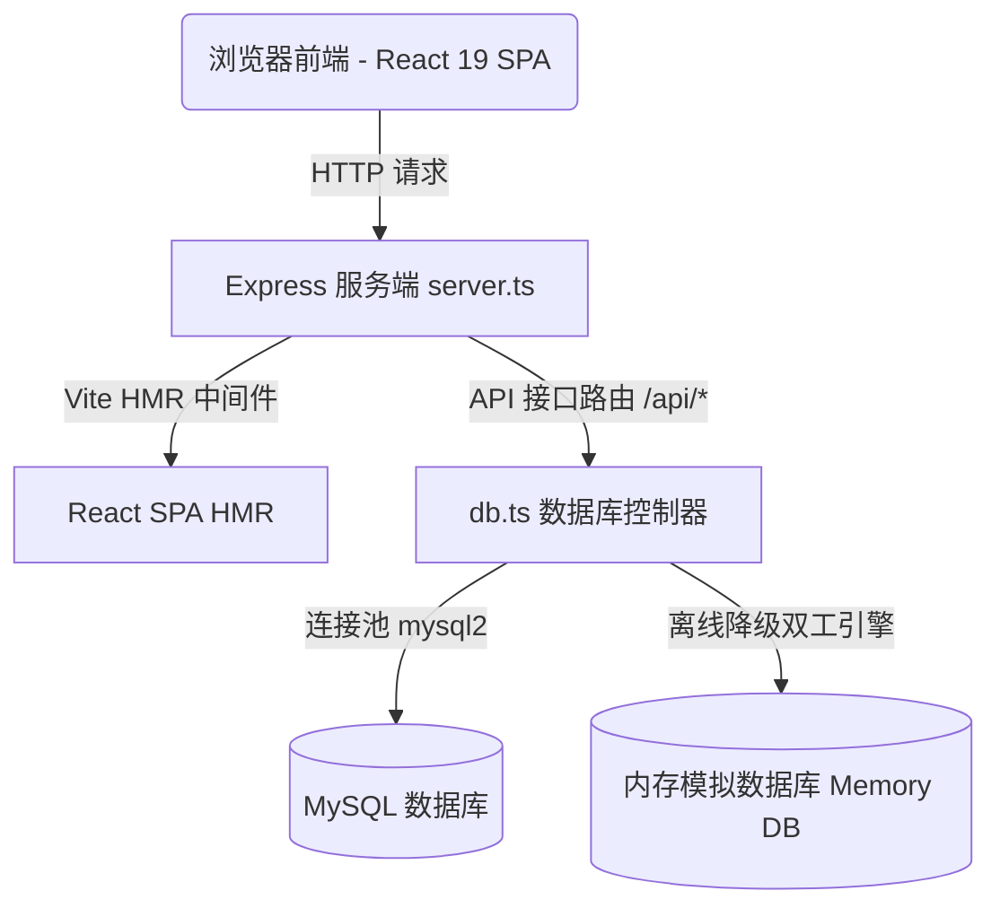

# 缩影自然 (MicroNature) - 智能绿植养护与 AI 问诊全栈平台

欢迎来到 **MicroNature (微自然 / 缩影自然)**！这是一个专为室内绿植、微缩造景（盆景、水族、雨林缸）爱好者设计的全栈智能互动平台。本项目深度整合了物联网式的环境指标监护、AI 植物智能诊断大脑、可视化造景设计沙盒、多维管理员 telemetry Telemetry 流量监控大盘，以及氧气社区和智慧百科。

---

## 🏗️ 架构设计与高可用设计

MicroNature 采用了现代化的**单体全栈架构 (Monolithic Full-stack)**，在保证高性能的同时，具备了强大的本地离线高可用兜底能力：



### 核心设计亮点：
1. **离线双工数据库引擎 (DB Fallback)**：
   在服务启动时，数据库控制器 `db.ts` 会尝试建立 MySQL 连接并执行表结构自动迁移（Migrations）和种子数据填充。若本地 MySQL 服务未开启或连接受阻，系统**不会崩溃**，而是自动平滑降级至 **内存模拟仿真模式 (Memory Fallback)**，所有增删改查及关联数据操作均在内存中完成，重启后重置。
2. **惰性 AI 初始化 (Lazy Gemini client)**：
   AI 诊断接口采用懒加载方式初始化 `GoogleGenAI` 客户端。若未在环境变量中配置 `GEMINI_API_KEY`，系统会自动启用内置的 **离线诊断生成器**，模拟出包含评估、对策的优雅 Markdown 报告，保障功能的完整展示。
3. **静动双态文件服务 (Multer + OSS Fallback)**：
   支持基于 `Multer` 的本地静态图片上传服务。若检测到云存储 OSS 配置，则自动将上传的二进制流分发至云端存储，并返回 CDN 链接。

---

## ⚙️ 技术栈

### 前端 (Frontend)
- **核心框架**：React 19.0.1 (具备 React 19 最新特性支持)
- **编译与脚手架**：Vite 6.2.3 + TypeScript 5.8
- **样式系统**：Tailwind CSS v4.1.14 (基于新一代 `@tailwindcss/vite` 编译器，极速构建)
- **动画引擎**：Framer Motion (motion 12.2) & CSS 微动画
- **数据可视化**：Recharts 3.8.1 (用于管理员大盘中流量、耗时、请求占比的多维图表展现)
- **图标系统**：Lucide React & Material Symbols

### 后端 (Backend)
- **服务端框架**：Express 4.21.2 & TypeScript
- **数据库驱动**：mysql2/promise 3.22 (支持连接池、异步 Query 与事务)
- **安全认证**：jsonwebtoken (JWT) + bcryptjs (密码哈希加盐)
- **多媒体处理**：multer (处理文件上传)
- **大模型接入**：Google Gemini SDK (`@google/genai` v2.4.0)

---

## 📌 核心功能模块

### 1. 探索世界 (Explore)
- 室内绿植灵感趋势与美图流。
- 基于当前养护绿植总量的碳吸收系数 ($kg/d$) 与空气净化量 ($K/m^3$) 实时估算。

### 2. 养护工作台 (Care Workbench)
- **实时指标监控**：监控植物土壤湿度、环境光照强度，标识 `optimal` (适宜) 与 `warning` (警告) 状态。
- **一键物联交互**：提供“浇水”（瞬间提升土壤水分并在完成阈值时更新状态）与“施肥”（瞬间重置植物状态为 Optimal）的交互按钮。
- **自定义植物卡片**：支持录入植物名称、分类、拉丁学名，并上传自定义植物封底。
- **养护代办清单**：支持添加浇水、追肥、散光、修剪任务，支持一键勾选，数据双向持久化。

### 3. 科普智慧百科 (Encyclopedia)
- 查阅绿植详细档案，涵盖光照要求 (Direct/Diffuse/Low)、毒性检测 (Safe/Toxic)、养护难度 (Easy/Medium/Hard) 以及浇水秘诀与照顾诀窍。
- 支持全文模糊搜索、难度和光照分类过滤。

### 4. 绿植造景设计沙盒 (Landscaping Design)
- **互动拖拽沙盒**：支持在画板中对铺底基质（赤玉土、火山石）、骨架石木（千层石、沉木）、微缩植物（苔藓、网纹草、冷水花）、器皿进行交互组合与拖拽。
- **实时造景预算**：根据添加的造景素材与单价，自动计算当前作品的总造景成本。
- **作品保存**：支持命名、选择器皿并保存作品至“我的造景”。

### 5. 氧气社区日志 (Community)
- 发布“绿色氧气日志”动态（支持配图上传）。
- 点赞日志，支持瞬时动画反馈。
- 树状评论系统，支持多名绿植爱好者在日志下方追加即时点评。

### 6. AI 植物医生 (AI Doctor)
- 结合 Google Gemini 的 `gemini-3.5-flash` 大模型，输入植物名称、目前症状，并携带当前湿度与光照环境参数，生成极具针对性、条理分明且亲切温暖的 **绿植智能诊断报告** (包括病情评估、紧急复苏指南、长期气候重塑和生态共生伙伴)。

### 7. 管理员 Telemetry 控制大盘 (Admin Dashboard)
- **流量 Telemetry 数据分析**：图表展示接口的 Latency (延迟)、Request Count (并发量) 和路由占比。
- **用户权限编辑**：对系统内所有注册用户进行角色提权 (`admin` / `user`) 与养护经验等级的修改，支持账号删除。
- **百科库管理 (CRUD)**：支持对百科库进行新增、编辑和下架删除，无缝对接自动化填报管线。
- **访问路径**：前端路由 `/houtaiadmin`。

---

## 🗄️ 数据库 Schema 设计

系统在 MySQL 中自动维护了以下 7 张关联数据表：

1. **`users` (用户身份表)**
   - 存储用户身份、加盐密码、角色权限 (admin / user) 及个人绿洲 bio 信息。
2. **`plants` (绿植监控卡片表)**
   - 存储监护的植物参数 (水分、光照、拉丁名、健康等级)，通过 `userId` 实现用户间数据隔离。
3. **`care_tasks` (养护日程待办表)**
   - 存储日常养护待办，与植物表外键关联，完成状态受 `done` 布尔控制。
4. **`community_posts` (绿色日志社区表)**
   - 存储社区广场的帖子、点赞数、评论数及关联发布人信息。
5. **`comments` (日志评论表)**
   - 存储针对日志帖子的多级评论，与 `community_posts` 表外键关联并实现级联删除 (`ON DELETE CASCADE`)。
6. **`encyclopedia_plants` (植物百科档案库)**
   - 存储权威百科数据，由管理员进行 CRUD 维护，也支持外来 bot 自动爬取录入。
7. **`traffic_logs` (流量遥测日志表)**
   - 记录所有以 `/api` 开头的 HTTP 请求方法、路由、IP 来源、客户端 User-Agent 以及接口处理耗时 (毫秒)，为管理员大盘提供精准的 Telemetry 支撑。

---

## 🚀 快速启动

### 1. 准备工作
请确保本地已安装 [Node.js](https://nodejs.org/) (推荐 v18 或更高版本) 和 [MySQL](https://www.mysql.com/) 数据库。

### 2. 配置环境变量
复制根目录下的 `.env.example` 并命名为 `.env`：
```bash
cp .env.example .env
```
根据本地配置编辑 `.env`：
```env
# MySQL 数据库配置
DB_HOST=localhost
DB_PORT=3306
DB_USER=root
DB_PASSWORD=your_password
DB_DATABASE=micronature

# JWT 秘钥
JWT_SECRET=your_custom_jwt_secret_key

# Gemini API Key (可选。若配置，可解锁真机实时 AI 诊断服务)
GEMINI_API_KEY=AIzaSy...
```

### 3. 安装依赖
在项目根目录下执行：
```bash
npm install
```

### 4. 启动开发服务器 (热重载模式)
```bash
npm run dev
```
启动后，后端将尝试连接 MySQL 并初始化数据库表。
终端会输出如下日志：
```bash
◇ injected env (3) from .env
正在尝试连接 MySQL 数据库...
✔︎ MySQL 数据库连接池建立成功！
Server running at http://localhost:3000
```
此时可在浏览器中访问 `http://localhost:3000` 体验系统。

*(提示：系统内置了两个默认账号供调试使用：)*
- **管理员账号**：用户名 `admin`，密码 `admin123` (可访问 `http://localhost:3000/houtaiadmin`)
- **普通用户账号**：用户名 `user`，密码 `user123`

---

## 📦 生产打包与部署

如需将项目打包成高性能的生产包进行部署，请执行以下命令：

1. **一键清理并构建**：
   ```bash
   npm run clean
   npm run build
   ```
   这会启动 Vite 编译压缩前端 SPA 产物输出至 `dist/`，并使用 `esbuild` 将后端的 TypeScript 文件打包合并成单文件 `dist/server.cjs`。

2. **启动生产包服务**：
   ```bash
   npm run start
   ```
   此时，Express 将作为高性能静态资源托管服务器提供前端展示，并暴露出高并发的生产 API 服务。

---

## 🐳 Docker 打包与运行

本项目已配置完整的 Docker 支持，您可以通过 Docker 单独构建，或使用 Docker Compose 快速一键拉起包括 MySQL 数据库在内的完整服务。

### 方式一：使用 Docker Compose 一键启动 (推荐)

在项目根目录下，直接执行以下命令：
```bash
docker-compose up -d --build
```
该命令会自动：
1. 启动一个 `mysql:8.0` 数据库容器并进行数据持久化配置。
2. 根据根目录下的 `Dockerfile` 编译并启动 Node 服务。
3. 容器内部会自动使用 `DB_HOST=db` 进行容器间通信，无需修改您本地的 `.env` 文件。

运行成功后，访问 `http://localhost:3000` 即可开始使用。

### 方式二：单独构建与运行 Docker 镜像

如果您只想将应用本身打包为 Docker 镜像，并连接到已有的外部 MySQL 数据库，可以按以下步骤操作：

1. **构建应用镜像**：
   ```bash
   docker build -t micronature-app .
   ```
2. **运行应用容器**：
   在运行容器时，将您需要的环境变量（如数据库连接信息、Gemini API Key等）传入：
   ```bash
   docker run -d \
     -p 3000:3000 \
     -e DB_HOST=your_db_host \
     -e DB_PORT=3306 \
     -e DB_USER=root \
     -e DB_PASSWORD=your_db_password \
     -e DB_DATABASE=micronature \
     -e GEMINI_API_KEY=your_gemini_key \
     --name micronature-container \
     micronature-app
   ```

---

## 📂 项目结构概览

```
micronature-V3/
├── src/                             # 前端 React 源码
│   ├── components/                  # UI 核心组件库
│   │   ├── Explore.tsx              # 探索与灵感趋势页面
│   │   ├── CareWorkbench.tsx        # 物联监护与任务工作台
│   │   ├── Encyclopedia.tsx         # 绿植智能分类百科
│   │   ├── LandscapingDesign.tsx    # 互动式造景设计沙盒
│   │   ├── Community.tsx            # 日志共享互动广场
│   │   ├── AIDoctor.tsx             # 基于 Gemini 3.5 的 AI 植物医馆
│   │   ├── AdminDashboard.tsx       # 管理员流量 Telemetry 监视大盘
│   │   ├── UserProfileModal.tsx     # 用户档案设置
│   │   └── LoginModal.tsx           # JWT 注册/登录浮层
│   ├── App.tsx                      # 客户端主页面与状态管理
│   ├── main.tsx                     # React 客户端启动入口与路由配置
│   ├── types.ts                     # TypeScript 全局接口定义
│   └── data.ts                      # 种子数据与品牌视觉定义
├── public/                          # 公共静态资源与 Multer 文件上传目录
├── db.ts                            # 数据库建表迁移、连接池管理与 Fallback 仿真模块
├── server.ts                        # Express API 后端路由与 Vite/静态托管服务器
├── package.json                     # 项目依赖与启动脚本
├── tsconfig.json                    # TS 编译配置
└── vite.config.ts                   # Vite 插件与构建优化配置
```
